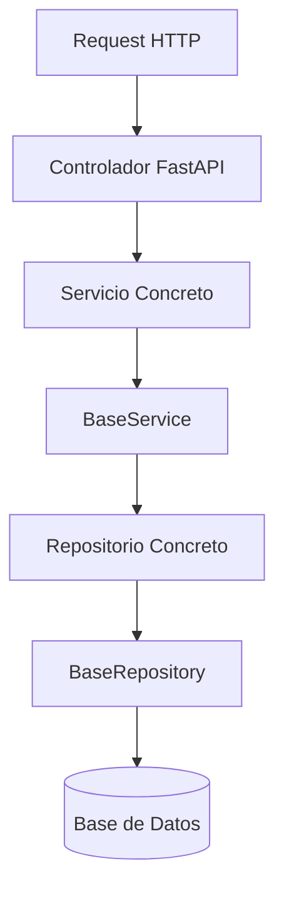
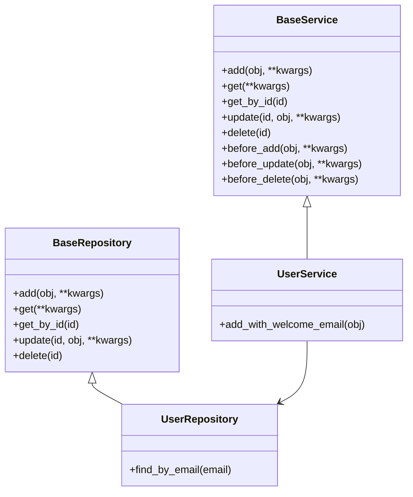

# Back End Project Arhitecture

ID: BR-5

# 📚 Guía de Uso y Buenas Prácticas — Servicios Base en FastAPI

Este documento define las reglas y la arquitectura para el uso de **BaseService** y **BaseRepository** en la aplicación.

El objetivo es **mantener consistencia, legibilidad y flexibilidad** en todos los módulos.

---

## 🏗 Arquitectura General

La arquitectura sigue el patrón de **Servicios + Repositorios** con una **clase base estándar** para CRUD y manejo de errores. Para lógica compleja o extensa, los servicios pueden usar **Engines**.

```
Controlador (FastAPI Endpoint)
    ↓
Servicio Concreto (UserService, ProductService, etc.)
    ↓
    ├── BaseService (CRUD genérico + Hooks + Manejo de errores)
    │       ↓
    │   Repositorio Concreto (UserRepository, ProductRepository, etc.)
    │       ↓
    │   BaseRepository (Interacción directa con la DB)
    │       ↓
    │   Base de Datos (SQLAlchemy / ORM)
    │
    └── Engine (lógica compleja, algoritmos, estrategias)
```

Ver [EnginesArchitecture.md](EnginesArchitecture.md) para detalles sobre la capa Engines.

---

## 📂 Estructura de Clases

### **BaseRepository**

- CRUD básico:
    - `add`
    - `get`
    - `get_by_id`
    - `update`
    - `delete`
- Operaciones directas con la base de datos.
- Uso de `*kwargs` para flexibilidad.

### **BaseService**

- Lógica de negocio común para todos los servicios.
- Manejo centralizado de excepciones.
- Hooks de validación:
    - `before_add`
    - `before_update`
    - `before_delete`
- Uso de `*kwargs` para permitir extensiones.

### **Servicio Concreto**

- Extiende `BaseService`.
- Contiene lógica de negocio específica del módulo.
- Puede sobreescribir hooks para validaciones personalizadas.
- Debe mantener la **firma estándar** para métodos CRUD.

### **Repositorio Concreto**

- Extiende `BaseRepository`.
- Contiene consultas específicas del módulo.

### **Engines (Capa de Lógica Compleja)**

- Para operaciones extensas, algoritmos o patrones de estrategia.
- Los servicios usan Engines cuando la lógica no encaja en CRUD.
- Ver [EnginesArchitecture.md](EnginesArchitecture.md) para detalles.

---

## 🔄 Flujo de Operaciones



---

## 📏 Reglas de Implementación

### 1. Mantener Firma Estándar

- Todos los métodos CRUD en los servicios concretos deben mantener la **misma firma** que en `BaseService`.
- Ejemplo:

```python
def add(self, obj_in: UserCreate, **kwargs):
    return super().add(obj_in, **kwargs)

```

### 2. Lógica Compleja → Método Nuevo

- Si la operación **rompe el contrato** de un CRUD estándar, crea un nuevo método en vez de sobrecargar uno existente.

```python
def add_with_notifications(self, obj_in: UserCreate):
    self.notification_service.send(obj_in.email)
    return super().add(obj_in)

```

### 3. Uso de **kwargs

- Permitido en **clases base**.
- En servicios concretos, preferir **parámetros explícitos** para legibilidad y autocompletado.

### 4. Uso de Hooks

- Validaciones o transformaciones deben ir en los hooks (`before_add`, etc.) siempre que sea posible.
- Validaciones muy específicas o que involucren múltiples servicios pueden ir directamente en el método.

---

## 📋 Ejemplo de Implementación

```python
class BaseService:
    def add(self, obj_in, **kwargs):
        self.before_add(obj_in, **kwargs)
        return self.repo.add(obj_in, **kwargs)

    def before_add(self, obj_in, **kwargs):
        pass

class UserService(BaseService):
    def before_add(self, obj_in, **kwargs):
        if not obj_in.email:
            raise ValueError("Email requerido")

    def add_with_welcome_email(self, obj_in):
        user = super().add(obj_in)
        self.email_service.send_welcome(user.email)
        return user

```

---

## 🗺 Diagrama de Interacción Entre Clases



---

## 📌 Conclusiones

- **Consistencia en firmas** → Facilita mantenibilidad y testeo.
- **Engines** → Para lógica compleja; ver [EnginesArchitecture.md](EnginesArchitecture.md).
- **Extender, no sobrecargar** métodos básicos para lógica especial.
- **Hooks** para validaciones comunes, lógica compleja en métodos específicos.
- **kwargs** solo en la base, parámetros explícitos en módulos concretos.