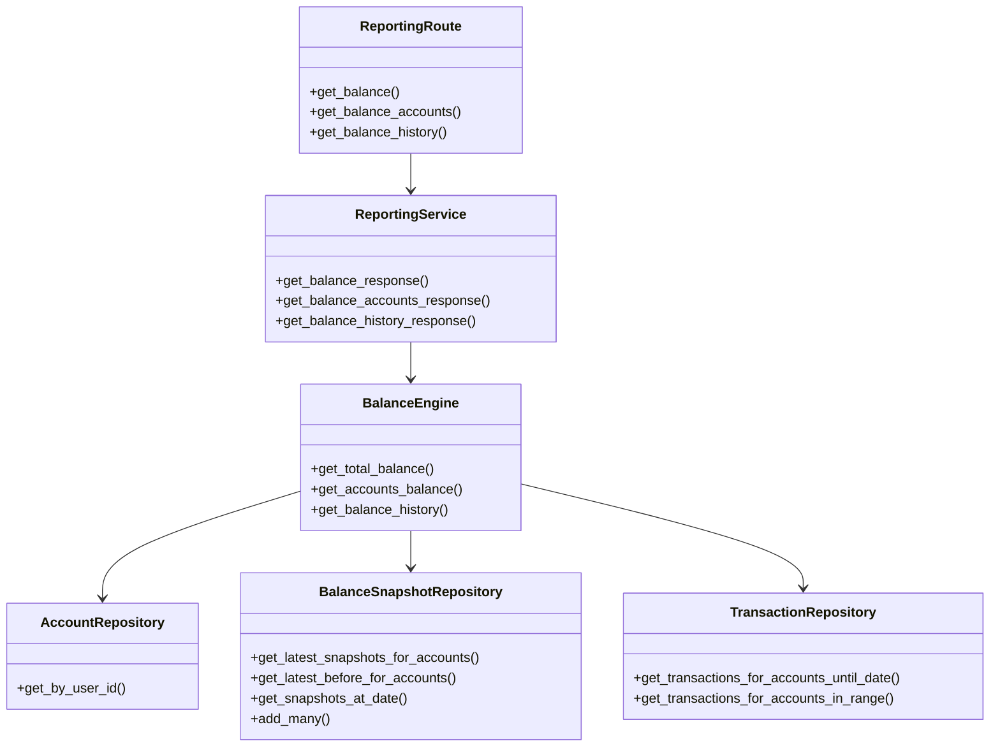
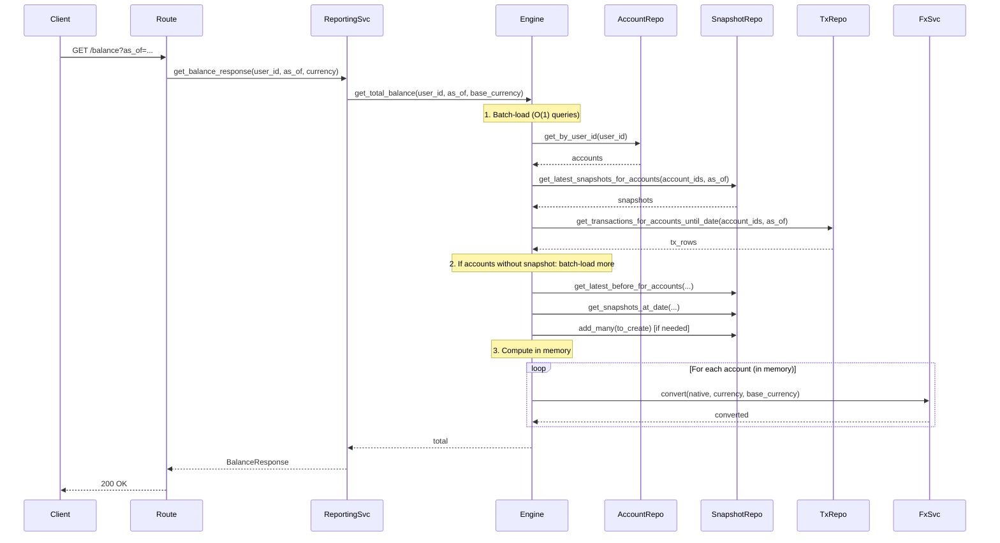
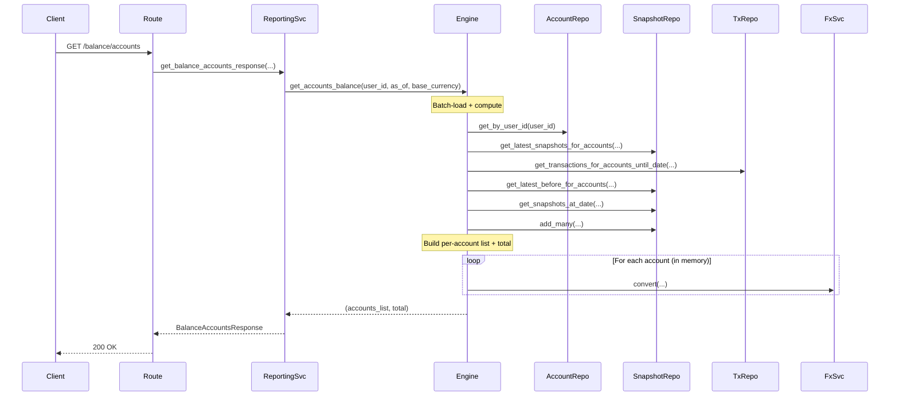
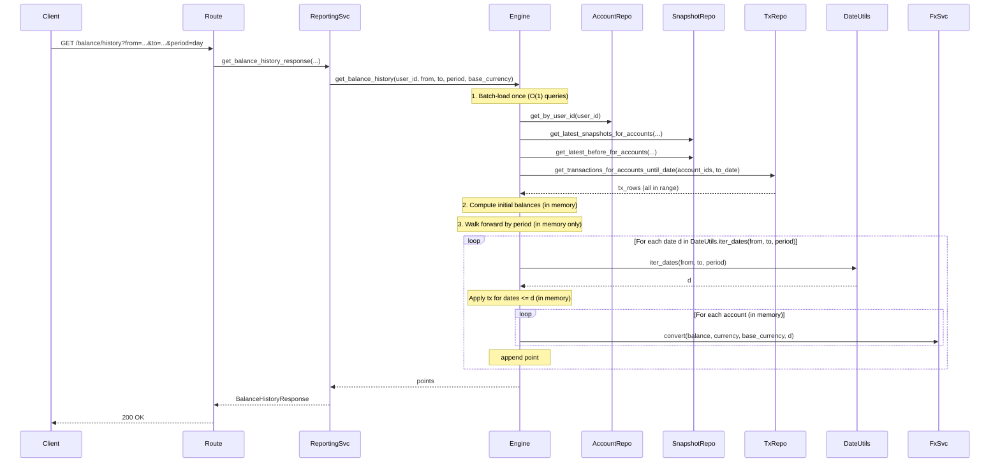

# Balance Engine — Architecture Diagrams

Mermaid diagrams for the engine-based balance implementation (O(1) queries, N+1 safe).

---

## 1. High-Level Architecture

```
┌─────────────┐     ┌─────────────────────┐     ┌──────────────────────┐
│   Route     │────▶│  ReportingService   │────▶│  BalanceEngine        │
│             │     │  (validates + calls)│     │  (batch-load + compute)│
└─────────────┘     └─────────────────────┘     └──────────┬───────────┘
                                                          │
                                                          ▼
                                                ┌──────────────────────┐
                                                │  Repositories        │
                                                │  (set-based queries) │
                                                └──────────────────────┘
```

---

## 2. Component Diagram



---

## 3. Flow 1: GET /balance (Total Balance)



**Query count:** ~7–10 (constant regardless of N accounts)

---

## 4. Flow 2: GET /balance/accounts (Per-Account Balances)



**Query count:** ~7–10 (constant regardless of N accounts)

---

## 5. Flow 3: GET /balance/history (Balance Over Time)



**Query count:** ~6–8 (constant regardless of D days or N accounts)

**Key difference from old design:** No DB calls inside the date loop. All data is loaded once; history is built in memory.

---

## 6. Engine Data Flow (BalanceEngine.get_total_balance)


---

## 7. Engine Data Flow (BalanceEngine.get_balance_history)


---

## 8. Query Summary

| Endpoint              | Queries (O(1)) | Notes                                           |
|-----------------------|----------------|-------------------------------------------------|
| GET /balance          | ~7–10          | Auth + accounts + snapshots + tx + lazy-create  |
| GET /balance/accounts | ~7–10          | Same as above + per-account list                |
| GET /balance/history  | ~6–8           | Auth + accounts + snapshots + tx once; walk in memory |

**Guarantee:** Query count does not scale with number of accounts (N) or number of days (D).
