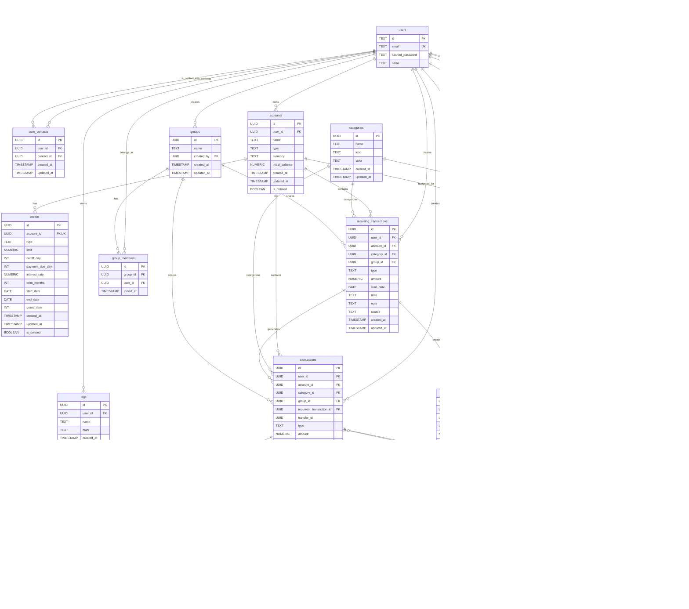

# Database Schema Documentation

## Entity-Relationship Diagram

This document provides a visual representation of the Smart Finances database schema using an Entity-Relationship (ER) diagram.

## Table Descriptions

### Core User Management
- **users**: Authentication and basic user information
- **profiles**: Extended user profile information
- **user_contacts**: User contact relationships

### Financial Management
- **accounts**: User financial accounts (bank, credit, etc.)
- **credits**: Credit card and loan information
- **categories**: Transaction categorization
- **tags**: User-specific transaction tags
- **transaction_tags**: Association between transactions and tags
- **transactions**: Financial transactions
- **installments**: Installment payment tracking
- **recurring_transactions**: Recurring financial transactions

### Social Features
- **groups**: User groups for shared expenses
- **group_members**: Group membership tracking
- **user_debts**: Debt tracking between users
- **recurring_debt**: Recurring debt obligations

### Budgeting
- **budgets**: Budget definitions
- **budget_categories**: Budget-category associations

## Key Relationships

1. **User Hierarchy**: Users can have multiple accounts, transactions, budgets, and tags
2. **Account Types**: Accounts can be regular accounts or credit accounts (1:1 relationship)
3. **Transaction Flow**: Transactions can be categorized, tagged, have installments, and create debts
4. **Tag System**: Users can create private tags to organize their transactions
5. **Social Features**: Users can join groups and share expenses
6. **Budgeting**: Users can create budgets for specific accounts and categories
7. **Recurring Items**: Both transactions and debts can be recurring

## Notes

- All tables include `created_at` and `updated_at` timestamps for audit trails
- Soft deletion is implemented for accounts and credits using `is_deleted` flags
- UUID primary keys are used for security and scalability
- Foreign key relationships maintain referential integrity
- The schema supports both individual and group financial management
